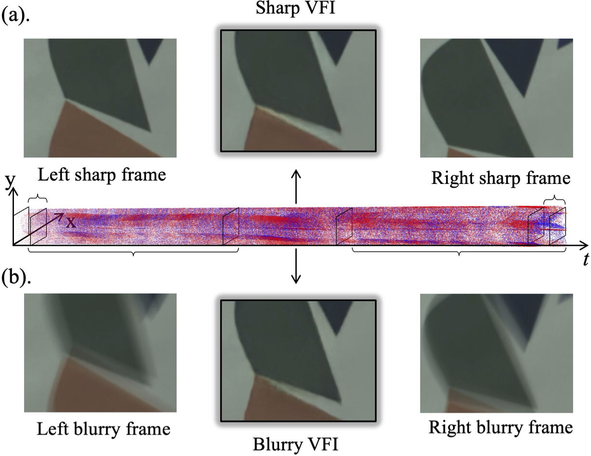
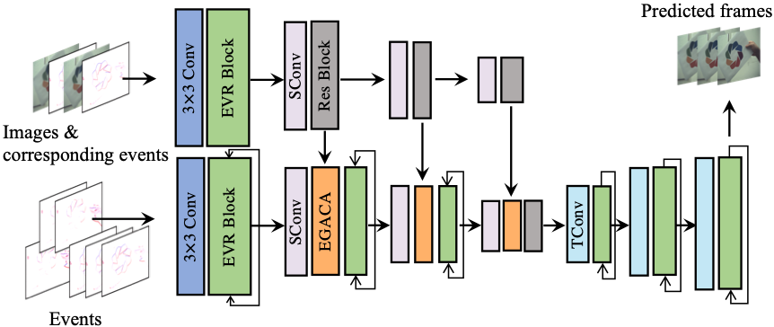
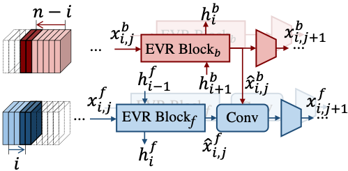
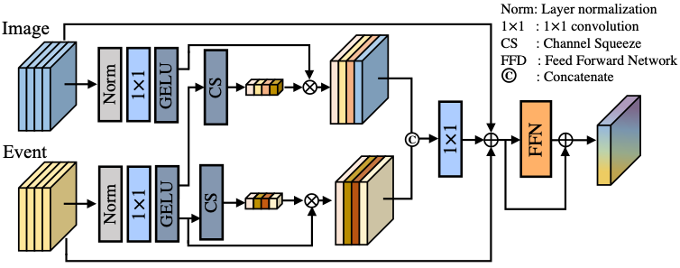
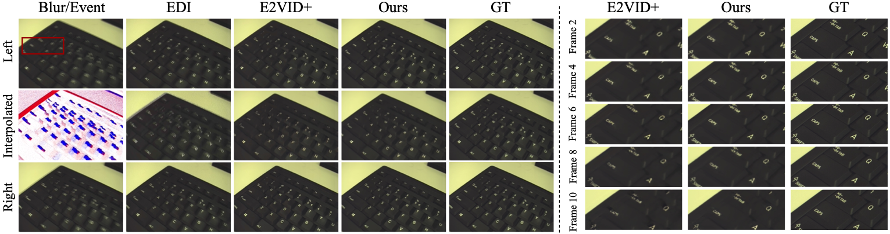
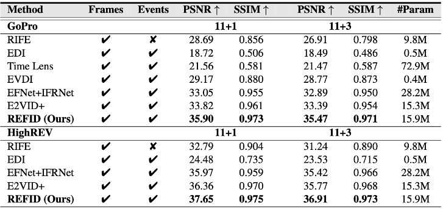
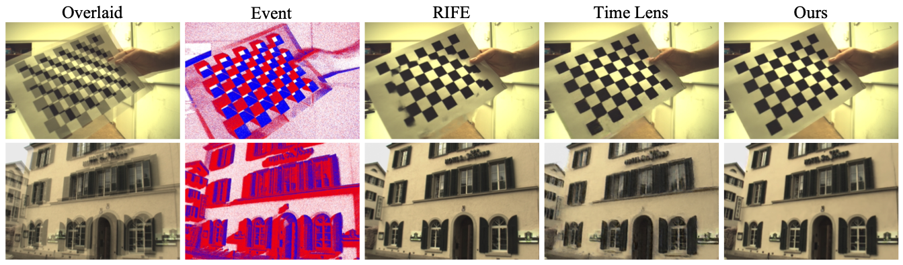
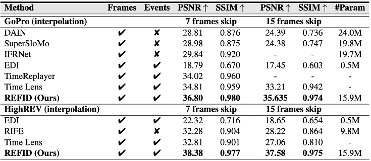
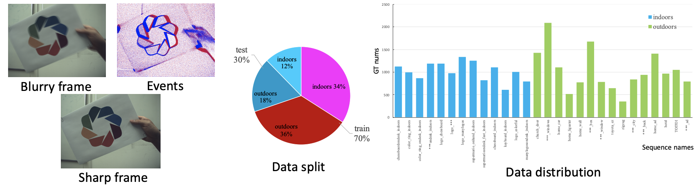

# Event-based Frame Interpolation with Ad-hoc Deblurring

#### [Lei Sun](https://ahupujr.github.io/), [Christos Sakaridis](https://people.ee.ethz.ch/~csakarid/), [Jingyun Liang](https://jingyunliang.github.io/), Peng Sun, Jiezhang Cao, Kai Zhang, Qi Jiang, Kaiwei Wang, Luc Van Gool
#### [Paper](https://openaccess.thecvf.com/content/CVPR2023/papers/Sun_Event-Based_Frame_Interpolation_With_Ad-Hoc_Deblurring_CVPR_2023_paper.pdf)
#### [CVPR virtual poster](https://cvpr2023.thecvf.com/virtual/2023/poster/22871)

# A Unified Framework for Event-based Frame Interpolation with Ad-hoc Deblurring in the Wild

#### [Lei Sun](https://ahupujr.github.io/), [Daniel Gehrig](), [Christos Sakaridis](https://people.ee.ethz.ch/~csakarid/), Mathias Gehrig,[Jingyun Liang](https://jingyunliang.github.io/), Peng Sun, Zhijie Xu, Kaiwei Wang, [Luc Van Gool](https://insait.ai/prof-luc-van-gool/), and [Davide Scaramuzza](https://rpg.ifi.uzh.ch/people_scaramuzza.html)

Work done in Robotics and Perception Group, UZH.
#### [Paper](TODO)


## News
- Feb 2025: Our dataset for journal version is available.
- Feb 2025: The journal version: A Unified Framework for Event-based Frame Interpolation with Ad-hoc Deblurring in the Wild is accepted by T-PAMI!
- June 2023: The codes and dataset are publicly available.
- March 2023: The paper is accepted by CVPR 2023


## Goal
<div style="text-align: center">

</div>

Unified framework for both event-based sharp and blurry frame interpolation.

Sharp frame interpolation:
- Short exposure time
- Sharp reference frames

Blurry frame interpolation:
- Long exposure time
- Blurry reference frames


## Model Architecture
<div style="text-align: center">

</div>


### Bi-directional event recurrent block
<div style="text-align: center">

</div>

### Event-guided adaptive channel attention
<div style="text-align: center">

</div>

## Results
<details><summary>Blurry frame interpolation (Click to expand) </summary>


</details>

<details><summary>Sharp frame interpolation (Click to expand) </summary>


</details>

## Installation
This implementation based on [BasicSR](https://github.com/xinntao/BasicSR) which is a open source toolbox for image/video restoration tasks. 

```python
python 3.8.5
pytorch 1.7.1
cuda 11.0
```


```
git clone https://github.com/AHupuJR/REFID
cd REFID
pip install -r requirements.txt
python setup.py develop --no_cuda_ext
```

## <span id="dataset_section"> HighREV dataset </span> 

<div style="text-align: center">

</div>

HighREV dataset is a event camera dataset with high spatial resolution. It can be used for event-based image deblurring, event-based frame interpolation, event-based blurry frame interpolation and other event-based low-level image tasks.

HighREV dataset includes:
- Blurry images (png)
- Sharp image (png)
- Event stream (npy)

The blurry images are synthesized from 11 sharp images, and we use [RIFE][rife_codes] to upsample the framerate of the original frames by 4 times. Thus each blurry image is synthesized from 44 sharp images.

We skip every 1/3 sharp images between each blurry image for frame interpolation task evaluation.

### Dataset Download

Because of the commercial reason, dataset download is allowed only with the authority of [Alpsentek][alpsentek_link]. Please contacting me or Alpsentek to get the authority from Alpsentek if needed.

## Weights
---
### GoPro
Blur VFI: [11+1](https://github.com/AHupuJR/REFID/releases/download/v0.1/REFID-GoPro-11-1.pth); [11+3](https://github.com/AHupuJR/REFID/releases/download/v0.1/REFID-GoPro-11-3.pth)

Sharp VFI: [7 skip](https://github.com/AHupuJR/REFID/releases/download/v0.1/REFID-GoPro-7skip.pth); [15 skip](https://github.com/AHupuJR/REFID/releases/download/v0.1/REFID-GoPro-15skip.pth)

[Single image deblur](https://github.com/AHupuJR/REFID/releases/download/v0.1/REFID-GoPro-single-deblur.pth)

### HighREV
Blur VFI: [11+1](https://github.com/AHupuJR/REFID/releases/download/v0.1/REFID-HighREV-1skip.pth); [11+3](https://github.com/AHupuJR/REFID/releases/download/v0.1/REFID-HighREV-3skip.pth)

Sharp VFI: [7 skip](https://github.com/AHupuJR/REFID/releases/download/v0.1/REFID-HighREV-7skip.pth); [15 skip](https://github.com/AHupuJR/REFID/releases/download/v0.1/REFID-HighREV-15skip.pth)

[Single image deblur](https://github.com/AHupuJR/REFID/releases/download/v0.1/REFID-HighREV-single-deblur.pth)


## Train
---
### GoPro

* train

  * ```python -m torch.distributed.launch --nproc_per_node=4 --master_port=4321 basicsr/train.py -opt options/train/GoPro/REFID.yml --launcher pytorch```

* eval
  * Download [pretrained model](https://github.com/AHupuJR/REFID/releases) to ./experiments/pretrained_models/
  * ```python basicsr/test.py -opt options/test/GoPro/REFID.yml  ```
  

### HighREV

* train

  * ```python -m torch.distributed.launch --nproc_per_node=4 --master_port=4321 basicsr/train.py -opt options/train/HighREV/REFID.yml --launcher pytorch```

* eval
  * Download [pretrained model](https://github.com/AHupuJR/REFID/releases) to ./experiments/pretrained_models/REFID-REBlur.pth
  * ```python basicsr/test.py -opt options/test/HighREV/REFID.yml ```
  

## Citations

```
@article{sun2023event,
  title={Event-Based Frame Interpolation with Ad-hoc Deblurring},
  author={Sun, Lei and Sakaridis, Christos and Liang, Jingyun and Sun, Peng and Cao, Jiezhang and Zhang, Kai and Jiang, Qi and Wang, Kaiwei and Van Gool, Luc},
  journal={arXiv preprint arXiv:2301.05191},
  year={2023}
}
```


## Contact
Should you have any questions, please feel free to contact leosun0331@gmail.com or leo_sun@zju.edu.cn


## License and Acknowledgement

This project is under the Apache 2.0 license, and it is based on [BasicSR](https://github.com/xinntao/BasicSR) which is under the Apache 2.0 license.


[rife_codes]: <https://github.com/megvii-research/ECCV2022-RIFE>
[alpsentek_link]: <https://www.alpsentek.com/>
[github_website]: <https://github.com/AHupuJR/REFID>